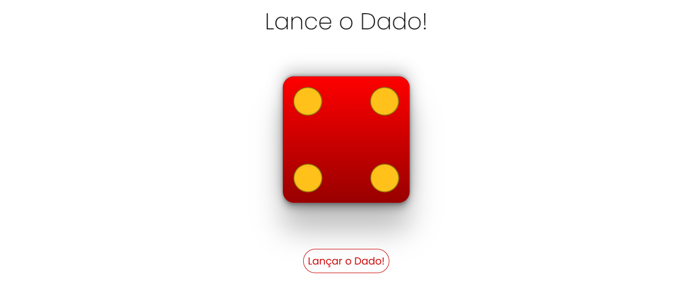

# 🎲 Roll the Die web version.

> Virtual Dice is a lightweight and responsive HTML/CSS/JavaScript project that displays a dice graphic and allows users to generate a new random dice roll by clicking a button. The result is shown visually on the dice face.

---

## 📸 Preview


Live Demo: https://samuel-fsilva.github.io/dado-virtual/

---

## 🚀 Features

- 🎲 Random dice roll from 1 to 6
- ✨ Clean and modern UI
- 📱 Responsive design
- 🟨 Custom dice graphic

---

## 🛠️ Technologies

- HTML
- CSS
- JavaScript (Vanilla)

---

## ⬇️ Installation

```
# Clone the repository
git clone https://github.com/samuel-fsilva/dado-virtual.git

# Enter the folder
cd dado-virtual
```

---

## ⚙️ Usage

- Download and unzip or clone the project
- Open index.html in your browser
- Enjoy!

---

## 📂 Project Structure

```
dado-virtual/
│── audio/
│── css/
│   └── animations.css
│   └── base.css
│   └── components.css
│   └── layout.css
│   └── style.css
│   └── utilities.css
│── images/
│── js/
│   └── app.js
│── index.html
│── 
│── README.md
```

---

## 🗺️ Roadmap

- [ ] Add the multiple dices instead just one
- [ ] Improved mobile responsiveness
- [ ] Add theme customization functionality (dark/light modes) 

---
## 🙋‍♂️ Author

GitHub: https://github.com/samuel-fsilva
